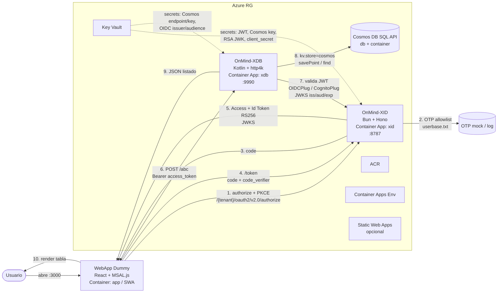

# Arquitectura

## Diagrama (Mermaid)



<!--
### Esquema

```
┌─────────────────────┐     OIDC / Entra facade      ┌──────────────────────┐
│  WebApp Dummy       │ ───────────────────────────► │  OnMind-XID (IdP)    │
│  (React + MSAL.js)  │ ◄── Access / Id Token        │  (Bun + Hono)        │
└─────────┬───────────┘                              └──────────────────────┘
          │
          │ Bearer Token + llamadas REST
          ▼
┌─────────────────────┐     Persistencia KV          ┌──────────────────────┐
│  OnMind-XDB         │ ───────────────────────────► │  Azure Cosmos DB     │
│  (Kotlin + http4k)  │                              │                      │
│  /abc  ·  /files    │                              └──────────────────────┘
└─────────────────────┘
```
-->
## Componentes

| Componente | Origen / Tec | Rol | Notas clave |
|---|---|---|---|
| IdP | onmind-xid (Bun+Hono) | Simula Entra ID (OIDC + subset Cognito) | Facade Entra: `/.well-known/openid-configuration`, authorize, token, userinfo, JWKS. OTP + allowlist `userbase.txt`. |
| API/DB | onmind-xdb (Kotlin+http4k) | Servicio datos | Principal `/abc` (POST JSON `AbcAPI`). KV `cosmos` + `CosmosPlug`. Auth `AuthProvider` Strategy (OIDCPlug/CognitoPlug). |
| WebApp | `app/` React+Vite+`@azure/msal-browser` | Cliente | loginRedirect → token → `POST /abc` con Bearer. |
| Persistencia | Cosmos DB SQL API | Backend XDB | Cuenta + database + container. Emulador local para dev. |
| Infra | Container Apps + ACR + Cosmos + KV + SWA | Host | 100% Terraform en `iac/terraform/`. |
| CI/CD | Azure DevOps Pipelines | Build→Test→Deploy→Smoke | `pipe/azure-pipelines.yml`. |

## Infra Azure (Terraform)

`iac/terraform/`:

- `main.tf`: providers `azurerm`, RG, Log Analytics, CAE, identidades, roles.
- `acr.tf`: Azure Container Registry (Basic/SKU variable).
- `cosmos.tf`: cuenta SQL API + sql database + sql container (`/pk` o `/id`).
- `container-apps.tf`: `xid` y `xdb` Container Apps con ingress, env/secrets desde Key Vault, probes (`/health`, `/abc`).
- `keyvault.tf`: Key Vault + secrets (jwt-secret, cosmos-key/endpoint, rsa-jwk, xid-client-secret). Access via Managed Identity + RBAC.
- `swa.tf`: Static Web App opcional para `app/` (desactivable con `enable_swa=false`).
- `variables.tf` / `outputs.tf`: parametrización total (location, tenant xid, imágenes, cosmos throughput, etc.).

Secrets nunca en código: Key Vault + Managed Identity o `variableGroup` del pipeline.

## Variables de entorno y secrets

### XID (`config/xid.env.example`)

- `PORT=8787`
- `XID_TENANT=common` — tenant facade Entra (`common` / guid).
- `XID_ISSUER=https://<xid-host>/<tenant>/v2.0` — debe coincidir con `iss` que valida XDB.
- `XID_JWKS_RSA_PRIVATE_JSON` (Key Vault `xid-rsa-jwk`) — clave RS256 firma.
- `XID_JWT_SECRET` (KV) — fallback HS256 si aplica.
- `XID_CORS_ORIGINS=http://localhost:3000,https://<swa-host>` — CORS.
- `XID_USERBASE_PATH=userbase.txt`, `XID_OTP_TTL=300`, `XID_OTP_MOCK=true` (dev).

### XDB (`config/onmind.ini.example`)

```ini
[server]
port=9990
[auth]
provider=oidc            ; oidc | cognito | none (solo local sin auth)
oidc.issuer=http://localhost:8787/common/v2.0
oidc.audience=api://xid-xdb / <client-id>
oidc.jwksUrl=http://localhost:8787/common/discovery/v2.0/keys
oidc.requiredClaims=sub,exp,iss
[kv]
store=cosmos             ; memory | h2 | cosmos
cosmos.endpoint=https://<cuenta>.documents.azure.com:443/
cosmos.key=<KV ref>
cosmos.database=onmind
cosmos.container=kv
```

En Container Apps se inyecta vía `secrets` con `keyVaultUrl` o `secretRef`.

### WebApp (`app/.env.example`)

- `VITE_XID_AUTHORITY=https://<xid-host>/common` (local: `http://localhost:8787/common`)
- `VITE_XID_CLIENT_ID=<app-registration-id>` — debe existir como `aud` válido en XID.
- `VITE_XDB_API_URL=http://localhost:9990` (Azure: `https://<xdb-host>`)
- `VITE_XDB_API_SCOPE=api://<client-id>/access_as_user` o `openid profile`.

## Puertos locales

- XID `:8787`, XDB `:9990`, WebApp `:3000`, Cosmos Emulator `:8081`.

## Decisiones

1. Facade Entra de XID como vía prioritaria (más realista que subset Cognito).
2. `/abc` como endpoint principal (compatible `AbcAPI` existente).
3. Cosmos SQL API con partición `/id` (simple para KV genérico).
4. Terraform único IaC; sin Ansible.
5. MSAL `loginRedirect` + PKCE (S256); `sessionStorage` para tokens.
