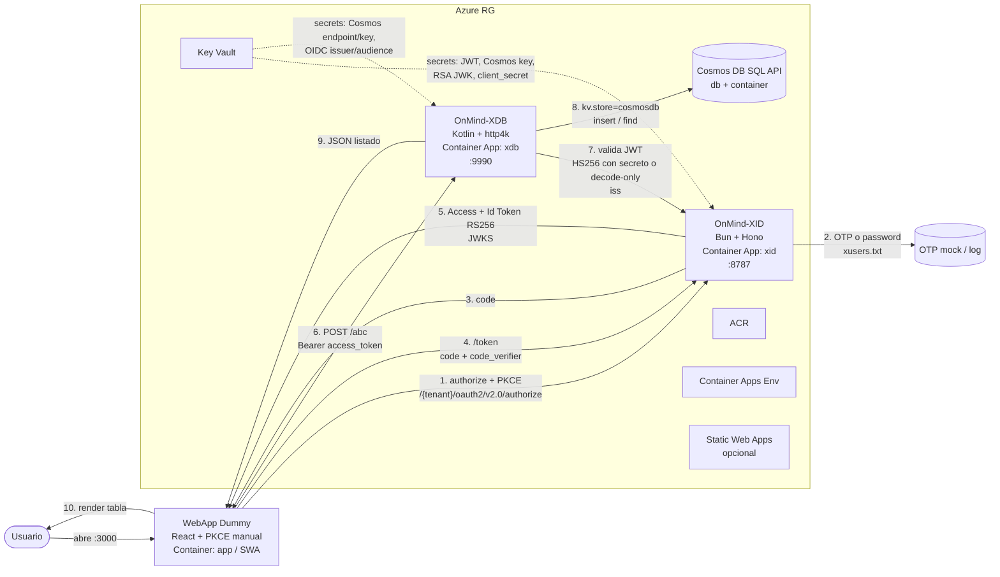
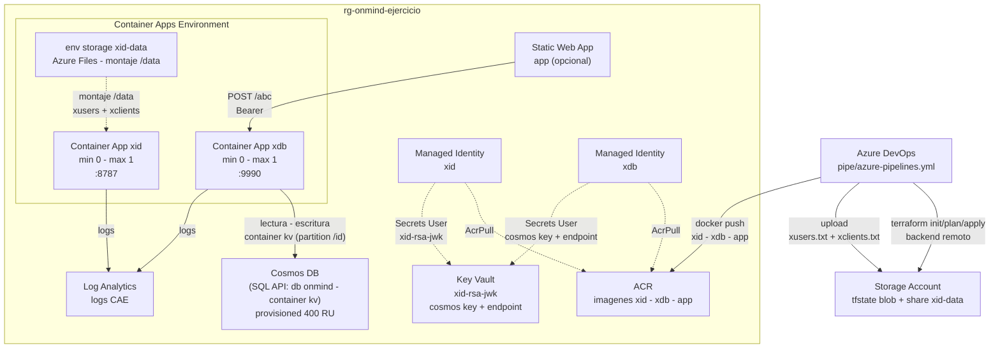

# Arquitectura

## Diagrama (Mermaid)



<!--
### Esquema

```
┌─────────────────────┐     OIDC / Entra facade      ┌──────────────────────┐
│  WebApp Dummy       │ ───────────────────────────► │  OnMind-XID (IdP)    │
│(React + PKCE manual)│ ◄── Access / Id Token        │  (Bun + Hono)        │
└─────────┬───────────┘                              └──────────────────────┘
          │ Bearer Token + POST /abc
          ▼
┌─────────────────────┐     Persistencia KV          ┌──────────────────────┐
│  OnMind-XDB         │ ───────────────────────────► │  Azure Cosmos DB     │
│  (Kotlin + http4k)  │                              │  SQL API             │
│  /abc  ·  /files    │                              └──────────────────────┘
└─────────────────────┘
```
-->
## Componentes

| Componente | Origen / Tec | Rol | Notas clave |
|---|---|---|---|
| IdP | onmind-xid (Bun+Hono) | Simula Entra ID (OIDC + subset Cognito) | Facade Entra: `/.well-known/openid-configuration`, authorize, token, userinfo, JWKS. OTP o password (bcrypt) + allowlist `xusers.txt`. |
| API/DB | onmind-xdb (Kotlin+http4k) | Servicio datos | Principal `/abc` (POST JSON `AbcAPI`). KV `mvstore`/`cosmosdb` (`KVStoreFactory`). Auth `auth.type=ENTRAID` (`AuthConfig` + `OIDCPlug`). |
| WebApp | `app/` React+Vite+PKCE manual (`fetch`, sin MSAL) | Cliente | authorize → token → `POST /abc` con Bearer. |
| Persistencia | Cosmos DB SQL API | Backend XDB | Cuenta + database + container. Emulador local para dev. |
| Infra | Container Apps + ACR + Cosmos + KV + SWA | Host | 100% Terraform en `iac/terraform/`. |
| CI/CD | Azure DevOps Pipelines | Build→Test→Deploy→Smoke | `pipe/azure-pipelines.yml`. |

## Infra Azure (Terraform)

`iac/terraform/`:

- `main.tf`: providers `azurerm`, RG, Log Analytics, CAE, identidades, roles.
- `acr.tf`: Azure Container Registry (Basic/SKU variable).
- `cosmos.tf`: cuenta (SQL API: es el lenguaje de Cosmos DB, no SQL Server) + database + container (`/id`).
- `container-apps.tf`: `xid` y `xdb` Container Apps con ingress, env/secrets desde Key Vault, probes (`/health`, `/abc`).
- `keyvault.tf`: Key Vault + secrets (jwt-secret, cosmos-key/endpoint, rsa-jwk, xid-client-secret). Access via Managed Identity + RBAC.
- `swa.tf`: Static Web App opcional para `app/` (desactivable con `enable_swa=false`).
- `variables.tf` / `outputs.tf`: parametrización total (location, tenant xid, imágenes, cosmos throughput, etc.).
- `files.tf`: Environment Storage `xid-data` (Azure Files en la cuenta del tfstate).

### Diagrama de infraestructura (IaC)



Secrets nunca en código: Key Vault + Managed Identity o `variableGroup` del pipeline.

## Variables de entorno y secrets

### XID (`config/xid.env.example`)

- `PORT=8787` (`Bun.serve` http; xid **no sirve HTTPS**).
- `XID_ENV=dev` — dev: `redirect_uri` abierto + OTP por consola si no hay SMTP; `production` lo exige todo.
- `XID_TENANT_ID=xid` — tenant por defecto cuando la URL usa `/common`, `/organizations` o `/consumers`.
- `XID_REDIRECT_ALLOWLIST=http://localhost:3000/*` — obligatorio solo en `production`.
- `XID_CORS_ORIGINS=http://localhost:3000,https://<swa-host>` — CORS (imprescindible para el `POST /token` desde el navegador).
- `XID_USERS_TXT=xusers.txt` — allowlist (`email` = solo OTP; `email:$2b$...` = password bcrypt
  con OTP de respaldo; gestionar con `bun run cli user ...` en xid).
- `XID_RSA_PRIVATE_JWK` (Key Vault `xid-rsa-jwk`) — JWK privada RS256; si se omite, claves efímeras por arranque.
- `XID_JWT_SECRET` (KV) — HMAC solo para flujos HS256/sesión; **no** valida los RS256 de la fachada Entra.
- `iss` y discovery **derivan del Host de la petición** (`originOf(req)` en `src/entra.js`): no existe
  `XID_ISSUER`. Tras un proxy TLS hay que preservar el header `Host` o el `iss` saldrá en http.

### XDB (`config/onmind.ini.example`)

> XDB solo lee `onmind.ini` como Properties (`Rote`); **ignora variables de entorno**.
> Claves reales (`AuthConfig` + `KVStoreFactory`).

```ini
dai.port = 9990
dai.cors = *

auth.enabled = true
auth.type = ENTRAID
auth.oidc.url = http://localhost:8787
auth.oidc.client_id = my-webapp
# JwtValidator solo verifica HS256 con secreto; los token Entra de XID son RS256:
# sin auth.jwt.secret se acepta el payload decodificado SIN verificar firma (solo dev).
# auth.jwt.secret = <solo si los tokens son HS256>

kv.store = mvstore
kv.mvstore.name = xybox
# kv.store = cosmosdb
# kv.cosmosdb.endpoint = https://<cuenta>.documents.azure.com:443/
# kv.cosmosdb.key = <key de Key Vault>
# kv.cosmosdb.database = onmind
# kv.cosmosdb.container = kvstore
```

En Container Apps el fichero no se puede montar sin Azure Files: lo genera
`scripts/entrypoint-xdb.sh` desde env al arrancar (imagen `scripts/Dockerfile.xdb`,
env `XDB_*`/`COSMOS_*` en `container-apps.tf`, secretos por referencia a Key Vault).

### WebApp (`app/.env.example`)

- `VITE_XID_AUTHORITY=https://<xid-host>/common` (local: `http://localhost:8787/common`).
  Sin MSAL no hay requisito de https: el flujo PKCE manual usa `fetch` directo.
- `VITE_XID_CLIENT_ID=<app-registration-id>` — debe existir como `aud` válido en XID.
- `VITE_XDB_API_URL=http://localhost:9990` (Azure: `https://<xdb-host>`)
- `VITE_XDB_API_SCOPE=api://<client-id>/access_as_user` o `openid profile`.

## Puertos locales

- XID `:8787`, XDB `:9990`, WebApp `:3000`, Cosmos Emulator `:8081`.

## Decisiones

1. Facade Entra de XID como vía prioritaria (más realista que subset Cognito).
2. `/abc` como endpoint principal (compatible `AbcAPI` existente).
3. Cosmos SQL API con partición `/id` (simple para KV genérico).
4. Terraform único IaC; sin Ansible.
5. PKCE manual en la SPA (`fetch`, S256 vía WebCrypto, sin MSAL); `sessionStorage` para tokens.

## Seguridad (postura actual: solo datos de prueba)

- **CORS `AllowAll` en XDB**: default upstream (base local open-source); se mantiene por conveniencia
  en este ejercicio. No es control de acceso: `curl` ignora CORS.
- **Controles reales hoy**: Bearer obligatorio en todo salvo `/health`; secretos en Key Vault;
  ACR privado; identidades gestionadas (AcrPull, Secrets User).
- **Brechas conocidas**: sin `auth.jwt.secret`, XDB acepta payload decodificado **sin verificar
  firma** (un JWT autofirmado entra); ingress público sin restricción IP, VNet, WAF ni rate-limit.
- **Endurecimiento en orden** (fuera del alcance de este ejercicio):
  1) validación JWT real (si se admite/configura JWKS en **XDB**)
  2) restricción de red (ejemplo: Front Door + WAF delante, `ipSecurityRestrictions` en Container Apps)
  3) orígenes CORS específicos (si se admite/configura en **XDB**).
