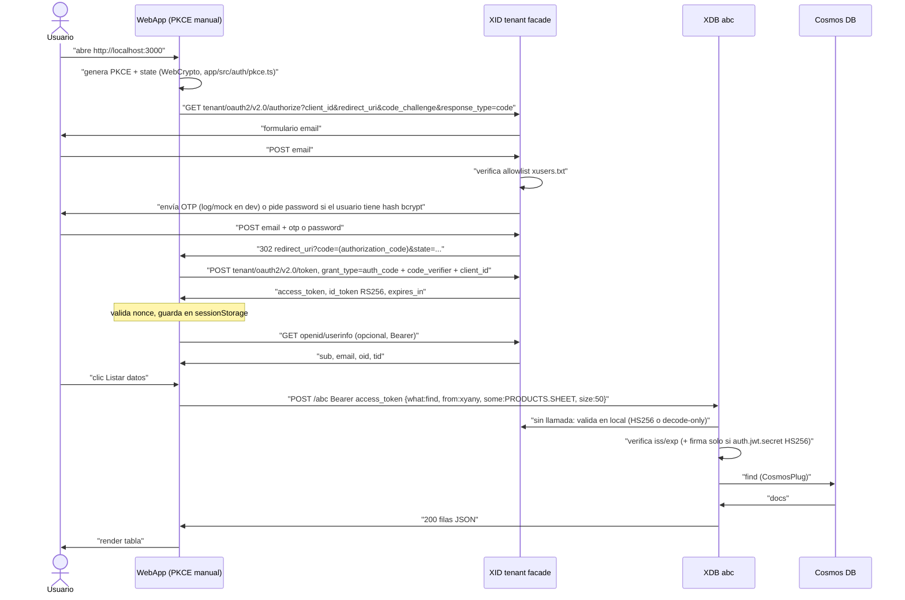

# Flujo de autenticación (facade Entra de XID)

## Secuencia OIDC completa



## Llamadas exactas (local)

```bash
TENANT=common
XID=http://localhost:8787
XDB=http://localhost:9990

# 1. Discovery
curl $XID/$TENANT/v2.0/.well-known/openid-configuration | jq '{issuer,authorization_endpoint,token_endpoint,jwks_uri}'

# 2. Authorize (abrir en navegador; el challenge lo genera app/src/auth/pkce.ts con WebCrypto)
echo "$XID/$TENANT/oauth2/v2.0/authorize?client_id=<CLIENT_ID>&response_type=code&redirect_uri=http://localhost:3000/&scope=openid%20profile%20api://<CLIENT_ID>/access_as_user&code_challenge=<CHALLENGE>&code_challenge_method=S256&state=xyz"

# 3. Token (lo hace la app con fetch; equivalente curl post-login con code real)
curl -X POST $XID/$TENANT/oauth2/v2.0/token \
  -H 'Content-Type: application/x-www-form-urlencoded' \
  --data-urlencode grant_type=authorization_code \
  --data-urlencode client_id=<CLIENT_ID> \
  --data-urlencode code=<CODE> \
  --data-urlencode redirect_uri=http://localhost:3000/ \
  --data-urlencode code_verifier=<VERIFIER>

# 4. UserInfo
curl $XID/openid/userinfo -H "Authorization: Bearer <ACCESS_TOKEN>"

# 5. Listado XDB
curl -X POST $XDB/abc -H 'Content-Type: application/json' \
  -H "Authorization: Bearer <ACCESS_TOKEN>" \
  -d '{"what":"find","from":"xyany","some":"PRODUCTS.SHEET","size":"50"}'

# 5b. Alternativa /files
curl $XDB/files -H "Authorization: Bearer <ACCESS_TOKEN>"
```

## Validación en XDB

XDB (`auth.type=ENTRAID` → `OIDCPlug`, sin llamadas de red):

- Con `auth.jwt.secret` (HS256): verifica firma + `exp` + `iss == auth.jwt.issuer`.
- Sin secreto: acepta el payload decodificado **sin verificar firma** (solo dev).
- XDB **no valida RS256 ni consulta JWKS** en esta versión: no pongas `auth.jwt.secret`
  si los tokens vienen de la fachada Entra de XID (son RS256 → 401).
- `client_id` del flujo público no requiere registro: basta no vacío y que coincida
  entre authorize y token (`redirect_uri mismatch` / `client_id mismatch` si difieren).
- `redirect_uri` en dev (`XID_ENV=dev` + allowlist vacía) admite cualquier http/https;
  en `production` debe estar en `XID_REDIRECT_ALLOWLIST`.

Token Id vs Access: WebApp envía **access_token** a XDB. `id_token` solo para UI (nombre/email).

## Errores típicos

| Síntoma | Causa | Fix |
|---|---|---|
| `invalid_client` en /token | `client_id` vacío o distinto al de authorize | Reutilizar el mismo `client_id` en ambas llamadas |
| `code_verifier` fail | PKCE S256 mal generado | Generar con WebCrypto (SHA-256 + base64url sin padding), como `app/src/auth/pkce.ts` |
| `401 invalid_token` en XDB | `auth.jwt.secret` con tokens RS256, o `iss` distinto | Sin secreto en dev (decode-only); `iss` = origen real de XID |
| CORS missing + `401` en `/abc` | El 401 sale sin cabeceras (auth está fuera de Cors en xdb) o el preflight OPTIONS es rechazado | Parche aplicado en `xdb/onmindxdb.kt` (Cors fuera de auth + `Authorization` en allow-headers); reiniciar xdb |
| XDB ignora tu ini | `Rote` carga `../onmind.ini` → `~/onmind/onmind.ini` → `/app/onmind.ini` → `./onmind.ini` | Mira la línea `<fichero> --> Checked OK!` al arrancar; `dai.cors` no se lee (CORS va fijo en código) |
| CORS bloqueado | `XID_CORS_ORIGINS` sin origen webapp | Añadir `http://localhost:3000` y host SWA |
| OTP nunca llega | Buscarlo en el email | En dev sale por consola `[xid:mail:console]` (o Mailpit en 127.0.0.1:1025) |
