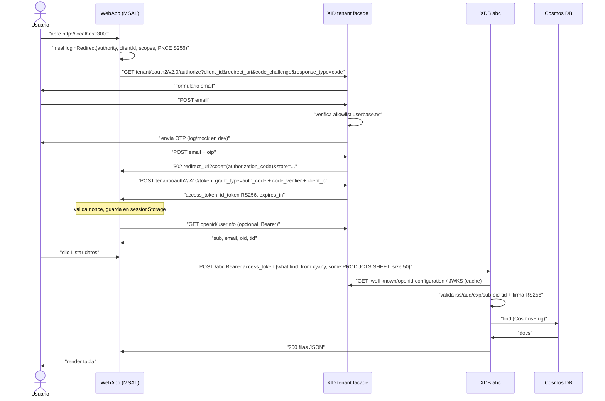

# Flujo de autenticación (facade Entra de XID)

## Secuencia OIDC completa



## Llamadas exactas (local)

```bash
TENANT=common
XID=http://localhost:8787
XDB=http://localhost:9990

# 1. Discovery
curl $XID/$TENANT/v2.0/.well-known/openid-configuration | jq '{issuer,authorization_endpoint,token_endpoint,jwks_uri}'

# 2. Authorize (abrir en navegador; PKCE lo genera MSAL automáticamente)
echo "$XID/$TENANT/oauth2/v2.0/authorize?client_id=<CLIENT_ID>&response_type=code&redirect_uri=http://localhost:3000/&scope=openid%20profile%20api://<CLIENT_ID>/access_as_user&code_challenge=<CHALLENGE>&code_challenge_method=S256&state=xyz"

# 3. Token (lo hace MSAL; equivalente curl post-login con code real)
curl -X POST $XID/$TENANT/oauth2/v2.0/token \
  -H 'Content-Type: application/x-www-form-urlencoded' \
  --data-urlencode grant_type=authorization_code \
  --data-urlencode client_id=<CLIENT_ID> \
  --data-urlencode code=<CODE> \
  --data-urlencode redirect_uri=http://localhost:3000/ \
  --data-urlencode code_verifier=<VERIFIER>

# 4. UserInfo
curl $XID/openid/userinfo -H "Authorization: Bearer <ACCESS_TOKEN>"

# 5. Listado XDB
curl -X POST $XDB/abc -H 'Content-Type: application/json' \
  -H "Authorization: Bearer <ACCESS_TOKEN>" \
  -d '{"what":"find","from":"xyany","some":"PRODUCTS.SHEET","size":"50"}'

# 5b. Alternativa /files
curl $XDB/files -H "Authorization: Bearer <ACCESS_TOKEN>"
```

## Validación en XDB

XDB (`OIDCPlug` / `CognitoPlug`, pattern `AuthProvider`):

- Descarga JWKS (`jwksUrl`), cache 10 min.
- Verifica firma RS256, `iss == oidc.issuer`, `aud` contiene `oidc.audience`, `exp > now` (skew 60s).
- Opcional `tid`/`oid`: si XID emite `tid=<tenant>` y `oid=<sub>`, mapear a `xykey` usuario/rol.
- `provider=none` solo permitido en local (`ALLOW_ANON=true`); prohibido en Azure (Terraform lo bloquea con var `xdb_auth_enforced=true`).

Token Id vs Access: WebApp envía **access_token** a XDB. `id_token` solo para UI (nombre/email).

## Errores típicos

| Síntoma | Causa | Fix |
|---|---|---|
| `invalid_client` en /token | `client_id` no registrado en XID | Añadir a config XID / misma var en WebApp y XDB audience |
| `code_verifier` fail | PKCE S256 mal generado | Dejar que MSAL lo genere; no reinventar |
| `401 invalid_token` en XDB | `iss` distinto (localhost vs FQDN) | Igualar `XID_ISSUER` y `oidc.issuer` incl. tenant |
| CORS bloqueado | `XID_CORS_ORIGINS` sin origen webapp | Añadir `http://localhost:3000` y host SWA |
| OTP nunca llega | `XID_OTP_MOCK=false` sin SMTP | Poner `true` en local; leer OTP en logs |
